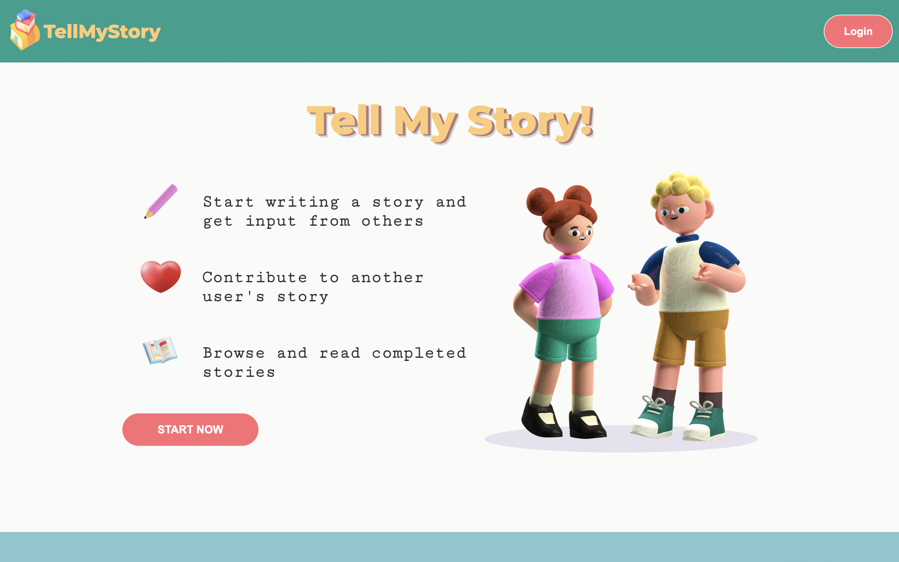
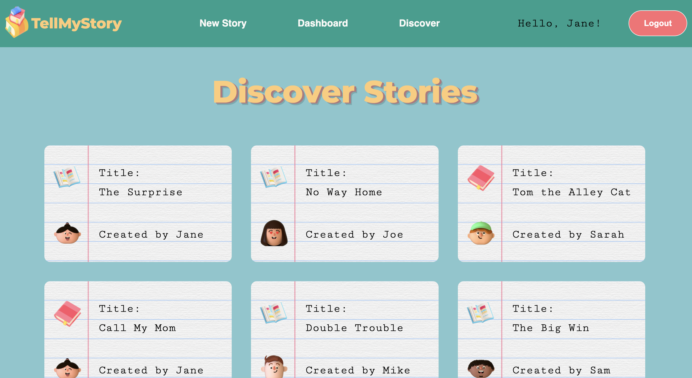
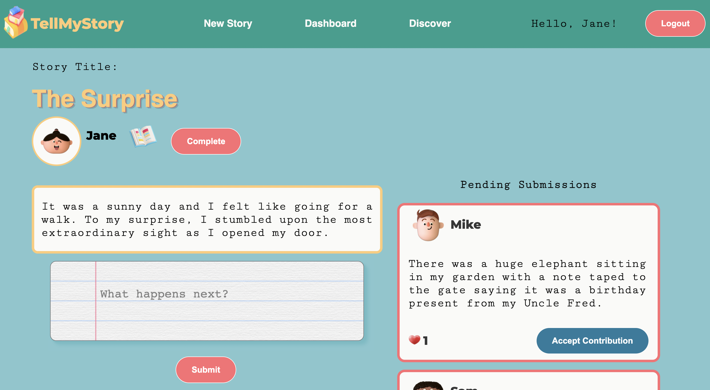
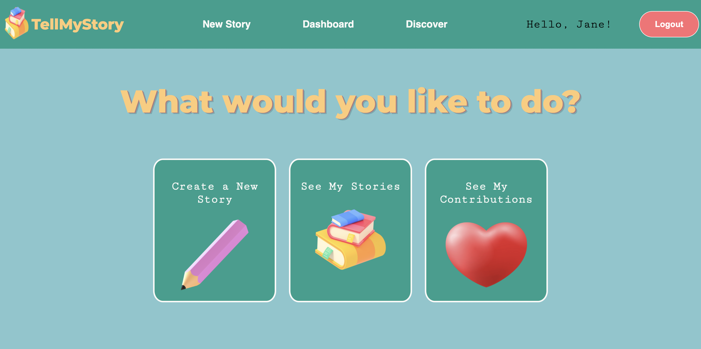
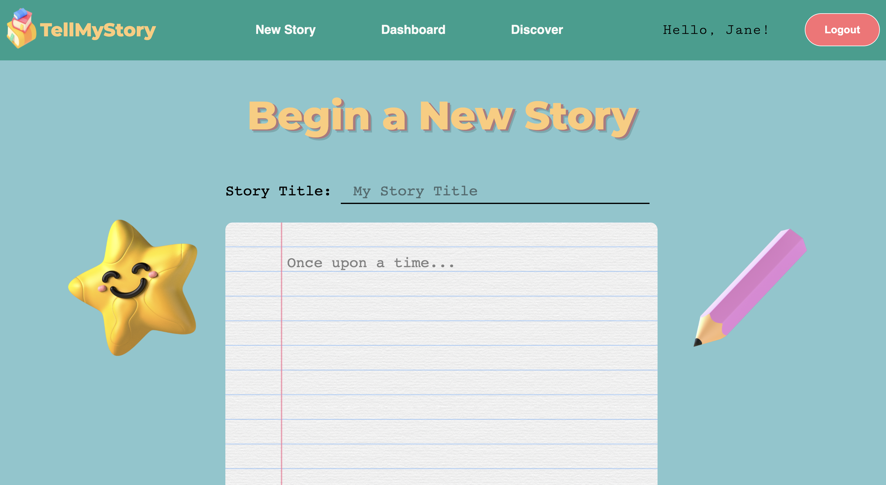
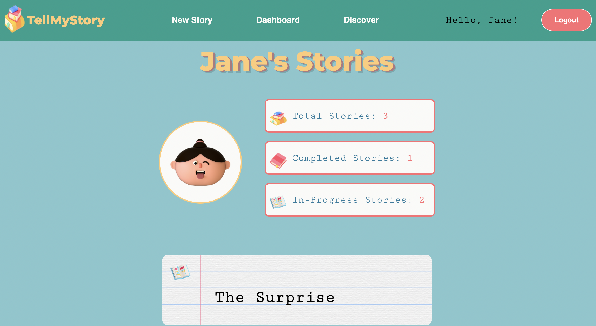
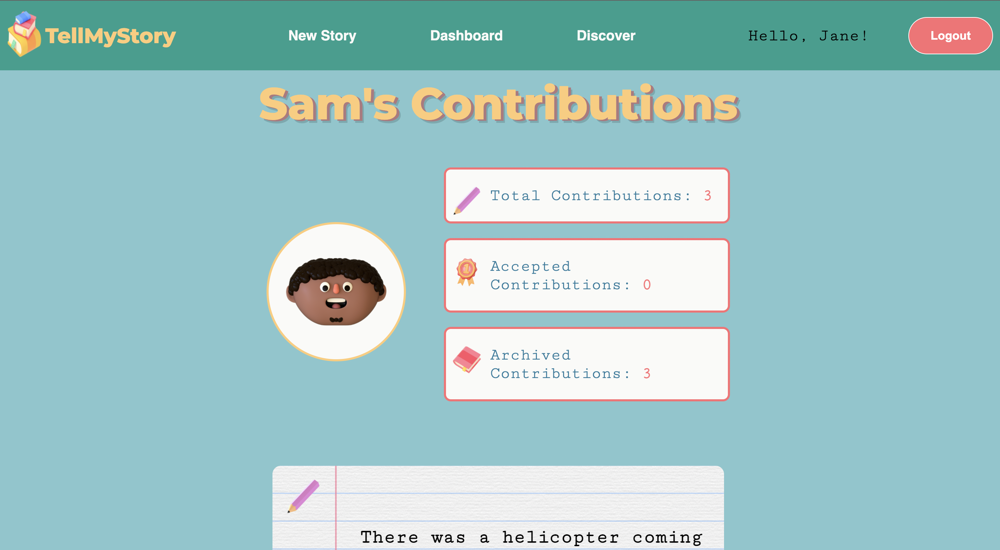

# Story-Creator: TellMyStory
---
## Overview
---
TellMyStory app that lets you write a story and lets other people contribute to that story. 

Users that created a story can select which contribution is worthy to the next part of the story, and reject all others.
## Features
---
Users can:
- Start a new story, accept contribution requests to their stories (which merges it to the rest of the story), and mark their story as completed.
- Add contribution requests to an existing story as long as the story has not been completed by the story creator
- Upvote a contribution, and see upvotes for a contribution
- View a list of stories from the homepage and the discover page,  along with their status (ie. in progress or completed)
- Read a story

## Look Inside
---
### Home 

### Discover Stories

### View and Interact With a Story

### User Dashboard

### Create a New Story

### View Stories Created by User

### View Contributions by User

## Getting Started
---
1. Go to our [node skeleton](https://github.com/lighthouse-labs/node-skeleton) repo and click the use this template button.
1. Create the `.env` by using `.env.example` as a reference: `cp .env.example .env`
2. Update the .env file with your correct local information 
3. Install dependencies: `npm i`
4. Fix to binaries for sass: `npm rebuild node-sass`
5. Reset database: `npm run db:reset`
  - Check the db folder to see what gets created and seeded in the SDB
7. Run the server: `npm run local`
  - Note: nodemon is used, so you should not have to restart your server
8. Visit `http://localhost:8080/` in your browser

## Dependencies
---
- [node](https://nodejs.org/en/) 10.x or above
- [npm](https://www.npmjs.com/) 5.x or above
- [body-parser](https://www.npmjs.com/package/body-parser)
- [dotenv](https://www.npmjs.com/package/dotenv)
- [express](https://expressjs.com/)
- [node-postgres](https://www.npmjs.com/package/pg) 6.x
- [chalk](https://www.npmjs.com/package/chalk)
- [ejs](https://ejs.co/)
- [morgan](https://www.npmjs.com/package/morgan)
- [sass](https://sass-lang.com/)

